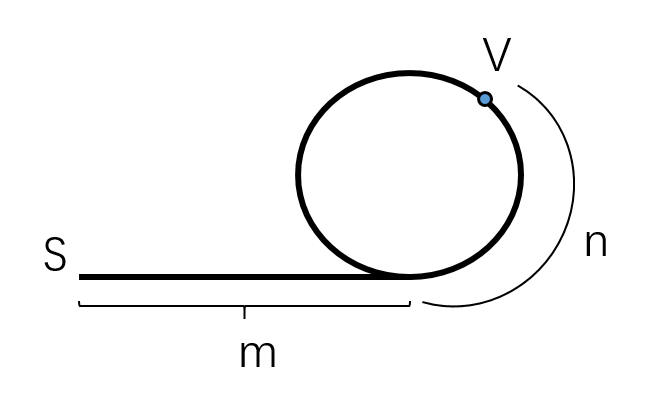

### Floyd判圈法

对于链表来说，经常会有关于环的问题。

这里详细讲解一下Floyd判圈，通过常用的快慢指针完成，其可以完成如下三个能力：

- 链表是否有环
- 链表若存在环，环的长度
- 链表若存在环，环的起点

*慢慢来*

假设存在这么一个链表：

慢指针`slow`每次往前走一个节点；快指针`fast`一次往前走两个节点。

两指针从S处出发，在V处相遇。

1. **链表是否有环**

   这个问题很显然，当链表没有环时，`fast`永远在`slow`的前面，直到`fast`到达链表的尾部，两者都不会相遇。当两者相遇，则必然表示链表内存在环。

2. **链表环长度**

   在上一个问题基础上，当链表有环时，我们不妨假设，两指针在V点相遇，随后`fast`不动，`slow`以每次一个节点的速度仍然进行遍历，当两者再次相遇时，遍历次数即环的长度。

3. **链表环的起点**

   这个问题稍复杂一些。

   我们不妨假设一堆如上图所示的参数，同时假设`fast`指针走过了环b次， `slow`走了环a次，最终在V点相遇，就有：

   $d_s=m+n+a*L$

   $d_f=m+n+b*L$

   $d_f=2*d_s$

   上述三个关系可以得到如下关系：

   $m+n=(b-2a)L$

   此时，`fast`永远领先`slow`有b-2a个环的距离。

   让`slow`回到起点，`fast`从相遇点V以每次一个节点继续向前走。当`slow`走到环入口U点，即m距离时，由上面的关系，`fast`也同样走过了`m=(b-2a)L-n`的距离，此时`fast`在环上相对U的位置为`(b-2a)L`，也就是说，

   **在慢指针`slow`到达环起点U时，快指针`fast`在到达U点后，绕了`b-2a-1`圈回到了环起点U点**。

   综上，**快慢指针在改变速度后相遇的位置即环起点**。

4. **同时可以求的链表无环部分长度，链表总长度**